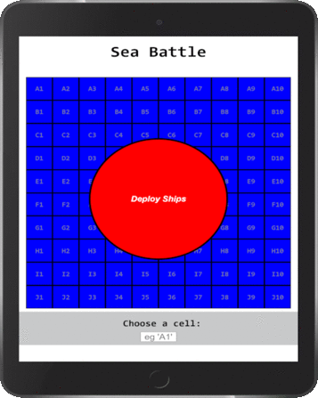

# Sea Battle

A single player version of battleship in which the player sinks ships that are randomly placed by an algorithm.

## Table of contents

- [General Information](#general-information)
- [Sample Images](#sample-images)
- [Technologies Used](#technologies-used)
- [Setup](#setup)
- [Features](#features)
- [Current Status](#current-status)
- [Contact](#contact)

## General information

The aim of this project was to gain experience using React.js, whilst completing a task to a specification in a job advert. It helped improve my understanding of state and props, and demonstrated to me the suitability of React to highly modular applications (including games like battleship, chess, etc).

On page load (or on pressing restart at the end of a game), the state of the App component is set. This uses a function that randomly places the ships and returns gridArray (a 100 long array of objects describing whether or not each cell on the grid had been bombed and whether it contains an intact or sunken ship. Using props, gridArray is used as a template by the gameBoard component to render 100 divs into a HTML grid, each with their own class attributes that allows, for example, bombed squares to be style differently to unbombed squares through css.

User input is taken either through a click event (via a function prop passed down to each grid square) or through text input (which initiates a click event on the appropriate square). These actions then update App.state, which re-renders the selected square. When a ship is bombed its hitpoint integer is reduced, until it reaches 0 at which point it is marked as 'sunk' (and styled as such via css). When all ships have been marked as sunk, the game ends and the user can restart by clicking the restart button (or refreshing the page) to reset state.

## Sample Images

#### A game in progress, viewed in Chrome DevTools:

## Technologies Used

- React.js
- HTML5
- CSS3

## Setup

The game can be played on my website at: (address to follow). It contains no images or dependencies, and can be rebuilt or hosted locally by cloning this repository and following the steps from the React documentation below:

### Getting Started with Create React App

This project was bootstrapped with [Create React App](https://github.com/facebook/create-react-app).

### Available Scripts

In the project directory, you can run:

#### `npm start`

Runs the app in the development mode.\
Open [http://localhost:3000](http://localhost:3000) to view it in the browser.

The page will reload if you make edits.\
You will also see any lint errors in the console.

#### `npm test`

Launches the test runner in the interactive watch mode.\
See the section about [running tests](https://facebook.github.io/create-react-app/docs/running-tests) for more information.

#### `npm run build`

Builds the app for production to the `build` folder.\
It correctly bundles React in production mode and optimizes the build for the best performance.

The build is minified and the filenames include the hashes.\
Your app is ready to be deployed!

See the section about [deployment](https://facebook.github.io/create-react-app/docs/deployment) for more information.

## Code Example

#### The following function creates an array object with 100 divs, each with classNames based on the state of that cell in the game.

    const newGrid = this.props.gridArray.map((cell) => {
      let className = "square";
      className += cell.ship ? " ship" : "";
      className += cell.sunk ? " sunk" : "";
      className += cell.bombed ? " bombed" : "";
      return (
        

      );
    });
    return newGrid;

#### When rendered by the gameBoard component, the display is updated based on the classes using radial colour gradients:

    .bombed {
        background: radial-gradient(black, blue, blue);
    }

    .ship.bombed {
        background: radial-gradient(red, orange, grey, grey);
    }

    .ship.sunk {
        background: radial-gradient(red, orange, blue);
    }

## Features

Things I like about the project:

- It is built from very basic components with no images or dependencies
- Component based structure and design abstraction allows the game to by modified to a different version with minimal changes to the code

New features that could be added / things that could be improved:

- Handling of keyboard input could be improved using regular expressions
- The game could be updated to a two-player version, possibly over a network, but this was not in the design specification and has copyright implications

## Current Status

The project is live on my website at (address to follow) for demonstration purposes. There are no current plans to modify it.

## Contact

For more information, please contact [@JakeMatthewsUK](https://www.jakematthews.uk/).
